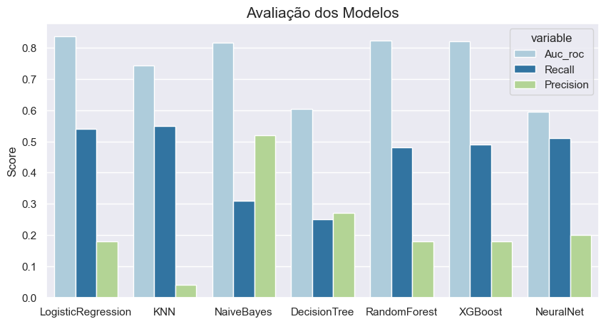
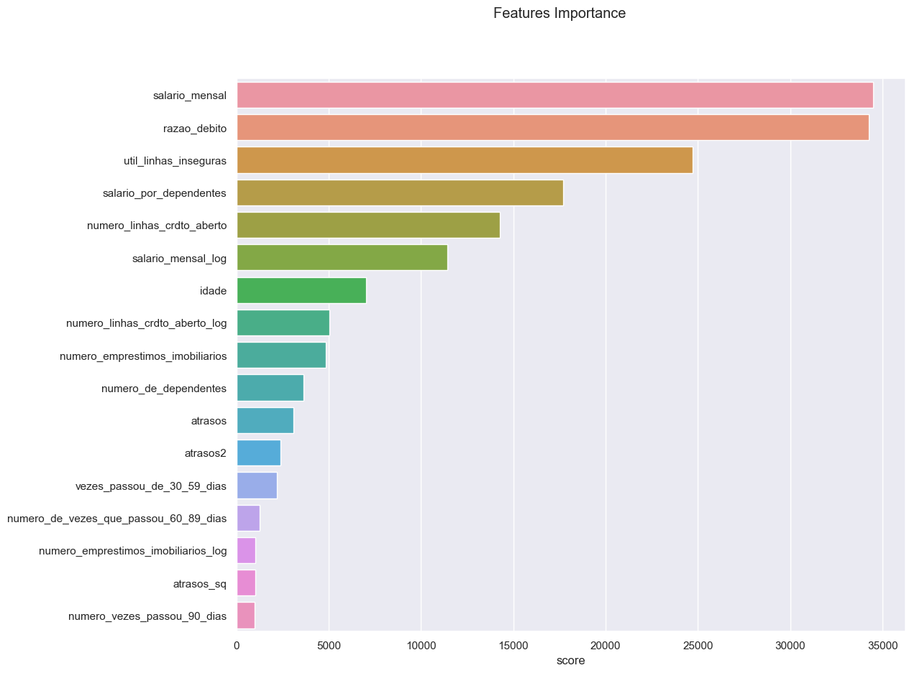

# Modelo Preditivo Para Aprovação de Crédito

## 1. Overview
Modelos de score de crédito calculam a probabilidade de inadimplência e são uma das
principais ferramentas utilizadas por diversas empresas para aprovar ou negar um
crédito.

O objetivo deste notebook é criar um modelo preditivo calculando a probabilidade de
inadimplência de cada novo pedido de crédito.

## 2. O Dataset

Cada linha representa um cliente e as colunas representam os dados (informações) desses
clientes.
A variável resposta é a coluna inadimplente, que indica se o tomador veio a se tornar
inadimplente(1) ou não(0).
As variáveis da base de dados são descritas abaixo:
* idade: A idade do cliente..
* numero_de_dependentes: O número de pessoas dependentes do cliente.
* salario_mensal: Salário mensal do cliente.
* numero_emprestimos_imobiliarios: Quantidade de empréstimos imobiliários que o
cliente possui em aberto.
* numero_vezes_passou_90_dias: Número de vezes que o tomador passou mais
de 90 dias em atraso.
* util_linhas_inseguras: Quanto que o cliente está usando, relativamente ao limite
dele, de linhas de crédito que não são seguradas por qualquer bem do tomador
e.g: imoveis, carros etc.
* vezes_passou_de_30_59_dias: Número de vezes que o cliente atrasou, entre 30
e 59 dias, o pagamento de um empréstimo.
* razao_debito: Razão entre as dívidas e o patrimônio do tomador. razão débito =
Dividas/Patrimônio
* numero_linhas_crdto_aberto: Número de empréstimos em aberto pelo cliente.
* numero_de_vezes_que_passou_60_89_dias: Número de vezes que o cliente
atrasou, entre 60 e 89 dias, o pagamento de um empréstimo.
<b>

Obs: Estes dados foram retirados de terceiros, portanto é possível que existam
incoerências, o que é perfeitamente comum em dados reais.</b>

## 3. Resultados
O modelo que apresentou o melhor score foi a Regressão Logística.

Além disso pudemos constatar que as features com maior importância foram o salário e a razão do débito.

